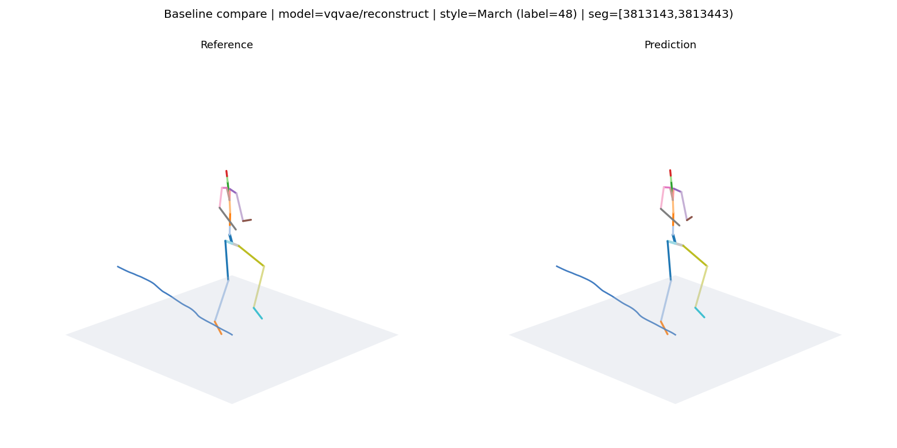

# VQFM4STYLE

Demo video: [`media/anim.mp4`](media/anim.mp4)

<!-- BVHView-style inline video on GitHub: paste the uploaded asset URL below on its own line. -->
<!-- https://github.com/user-attachments/assets/... -->
https://github.com/user-attachments/assets/00386e37-f093-4b3e-9380-87ee2b909351

`VQFM4STYLE` is a research codebase for style-aware human motion generation and real-time character control.

It follows a two-stage pipeline:
- train a `VQ-VAE` to learn a compact discrete representation of 375-d motion features;
- train a style-conditioned `Flow Matching` controller on top of the frozen latent space to generate the next motion step.

In short, this project is best understood as an experimental platform for motion style control, rollout, and visualization.
